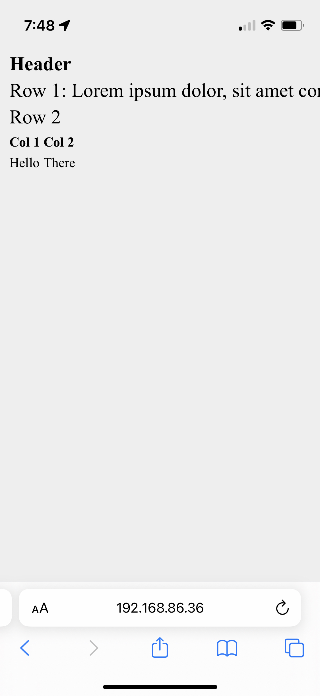
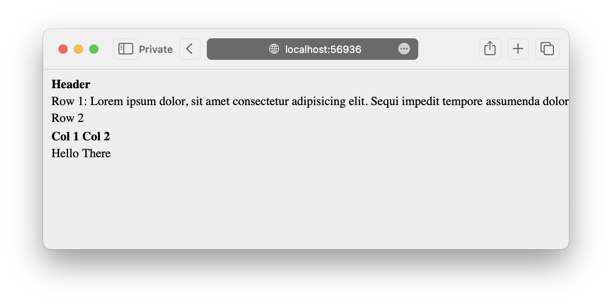

# ios-table-whitespace-text-size-bug

Text size is incorrectly (automatically) sized up by the browser when the table has `whitespace: nowrap` and the text is wider than the viewport.

See the bug on iOS 16.1.2:
[bug.html](bug.html)

Tested on iPhone 13 mini:

This bug is not reproducible on Safari on macOS 13.1:

